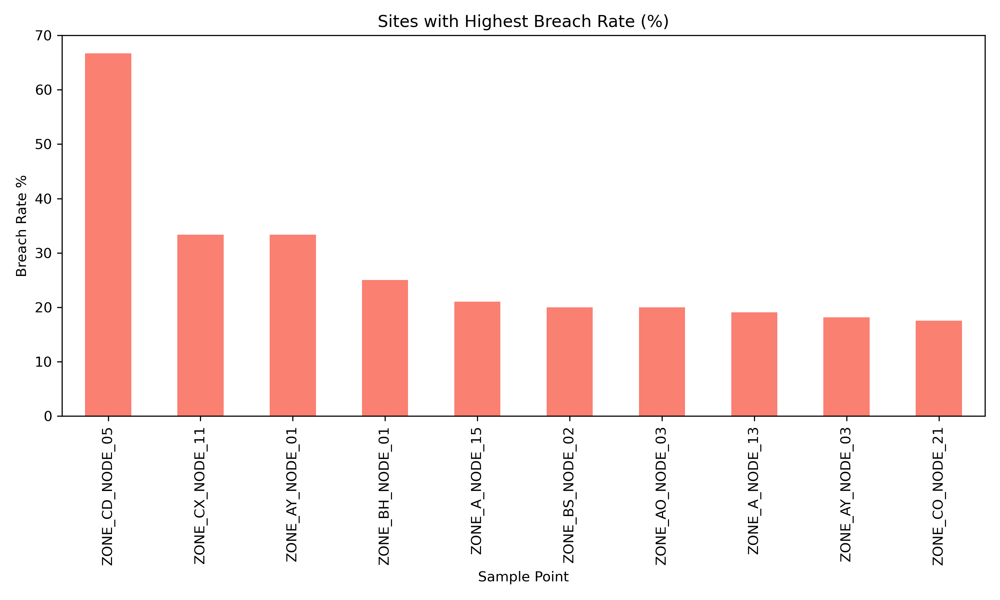
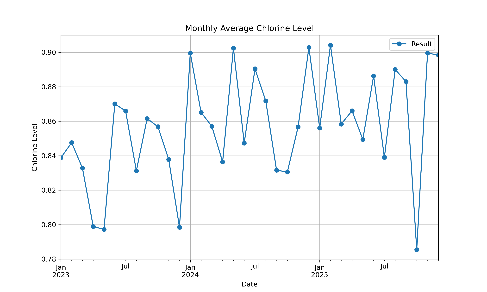

# Water Network Chlorine Compliance Analysis (Anonymized Operational Dataset)

## Project Overview

This project analyzes chlorine residual measurements across a large water distribution network to identify compliance risks, infrastructure issues, and operational improvement opportunities.

Maintaining adequate chlorine levels is critical to ensure microbiological safety and regulatory compliance.

This analysis uses real operational-style data (~79,862 records) to detect trends, high-risk locations, and potential system weaknesses.

---

## Business Problem

Water utilities must ensure chlorine levels remain above regulatory minimums.

Low chlorine levels can indicate:

• Contamination risk  
• Long water age / stagnation  
• Infrastructure problems  
• Sensor or operational issues  

This project identifies high-risk sample points and network trends.

---

## Dataset

Size: 79,862 records

Variables include:

• Sample point 
• Parameter  
• Result Date  
• Result 
• Limit Breached  

---

## Data Anonymization

This project uses real operational water quality data. To protect sensitive infrastructure information, all location identifiers have been anonymized.

Changes include:

• Real sample point names replaced with synthetic identifiers (e.g., ZONE_A_NODE_01)  
• Suburbs and infrastructure locations replaced with synthetic zones (ZONE_A, ZONE_B, etc.)  
• Site codes, user identifiers, and comments anonymized  

The anonymization preserves the original network structure, statistical relationships, and compliance patterns while ensuring infrastructure security.

ZONE_A represents a single consistent network zone used for analysis and exclusion scenarios where appropriate.

## Tools Used

Python  
Pandas  
Matplotlib  
NumPy   
Jupyter Notebook  

Dashboard:
Power BI

---

## Key Analysis Performed

Data cleaning and preprocessing  

Compliance breach detection  

Breach rate per sample location  

Time trend analysis  

Correlation analysis  

Anomaly detection  

Statistical analysis  

---

## Key Findings

• Network breach rate: 1.94%

• Highest risk site breach rate: 66.67%

• Several locations show consistently low chlorine residuals

• High-risk locations were identified for operational follow-up

---

## Example Visualizations

### Breach Rate by Location

---

### Chlorine Trend Over Time

---

Note: Sites using chloramination (ZONE_A zone) were excluded from free chlorine analysis because their disinfection strategy differs.

## Business Impact

This analysis enables water utility operators to:

• Identify high-risk locations before compliance failure

• Prioritize operational interventions

• Improve regulatory compliance

• Reduce public health risk

